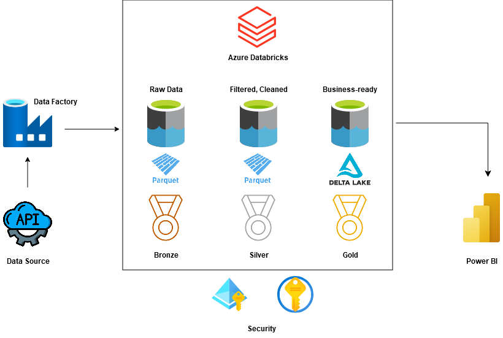
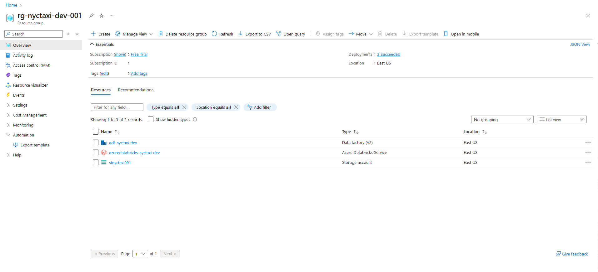
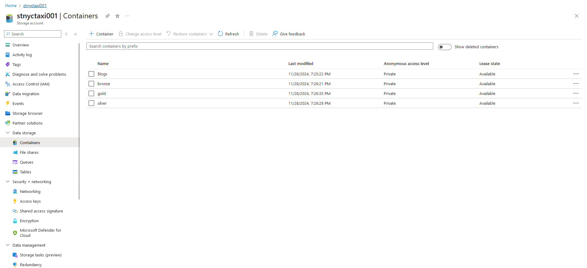
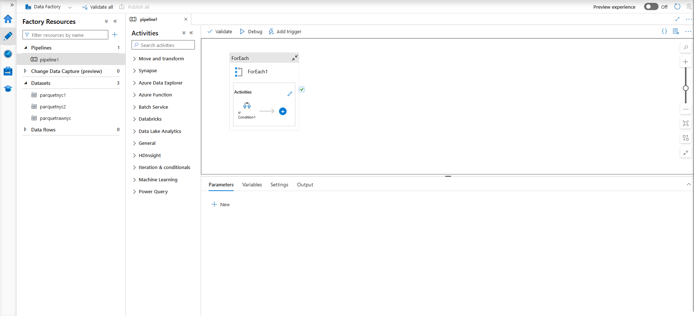
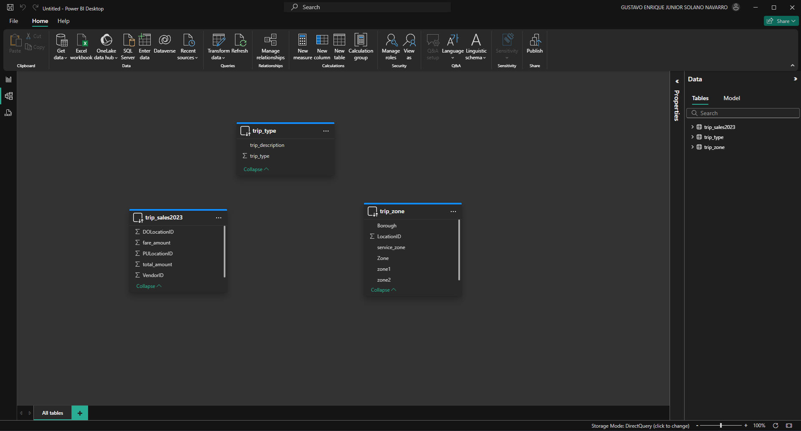

# End-to-End Azure Data Engineering Project

This project demonstrates how to ingest, process, and analyze data using Azure services. We set up a pipeline that processes raw data into silver (cleaned and structured data) and gold (optimized and aggregated data) layers for reporting and analytics.

## Architecture

## Steps

### Create Resource Group

Create a resource group in Azure to organize and manage all related resources.

### Create Data Lake (Storage Account)

Set up an Azure Storage Account to act as the Data Lake for storing raw, processed, and analytical data.

### Create Containers Based on Medallion Architecture

Within the Data Lake, create three containers:

- Raw: Stores unprocessed data.

- Silver: Stores cleaned and structured data.

- Gold: Stores aggregated and optimized data for reporting.

### Create Data Factory

Deploy an Azure Data Factory instance to orchestrate and automate data movement and transformation processes.

### Create Linked Services in Data Factory

Configure linked services to establish connections to external data sources and storage:

- HTTP Server: For ingesting data from APIs or external endpoints.

- Data Lake Storage: To enable reading from and writing to the Data Lake.

### Create ForEach, If Condition, and Copy Data Activities

Design a Data Factory pipeline using the following activities:

- ForEach: Iterates over datasets or parameters.
- If Condition: Adds conditional logic to workflows.
- Copy Data: Moves data from the source to the Raw container in the Data Lake.

### Create Service Principal

Create a Service Principal to manage permissions and authentication for Azure resources.

### Add Role Assignment to Service Principal

Assign the Storage Blob Data Contributor role to the Service Principal for the Storage Account to enable data access.

### Save Application ID, Directory ID, and Secret Key

Save the following credentials from the Service Principal configuration for later use:

- Application ID
- Directory ID
- Secret Key

### Create Azure Databricks Instance

Set up an Azure Databricks instance for advanced data processing and analytics.

### Create Compute Resources

Provision a compute cluster in Azure Databricks to process large volumes of data.

### Create Workspace (Silver Notebook)

Create a Databricks notebook to transform raw data into structured data and save it to the Silver layer in Parquet format.

### Transform and Export to Silver Layer

Write transformation logic in the notebook to clean and structure raw data. Export the processed data to the Silver container in the Data Lake.

### Create Workspace (Gold Notebook)

Create a second Databricks notebook for advanced transformations and aggregations.

### Transform and Export to Gold Layer

Write logic to further process Silver data and export it to the Gold container in Delta format for analytics and reporting.

### Create Access Token for Power BI

Generate an Azure Databricks access token to integrate with Power BI for visualization and reporting.

## Medallion Architecture Overview

- Raw Layer: Ingested data as-is.

- Silver Layer: Data cleaned, transformed, and enriched.

- Gold Layer: Aggregated, ready-to-use data for business insights.

## Requirements

- Azure Subscription

- Azure CLI or Portal Access

- Power BI for data visualization

- Technologies Used

- Azure Resource Manager

- Azure Data Lake Storage

- Azure Data Factory

- Azure Databricks

- Power BI

## Next Steps

- Configure Power BI dashboards using the Gold layer as the data source.

- Monitor pipelines and implement alerting mechanisms.

- For further assistance or customizations, feel free to reach out!